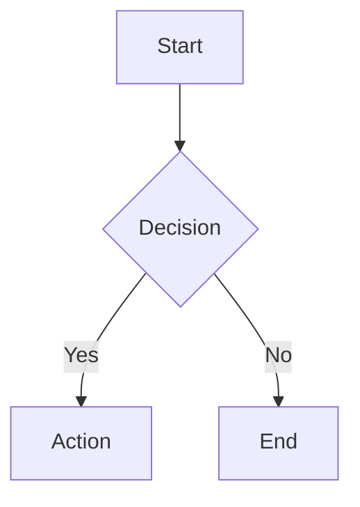

+++
title = "Agent-native everything else: games are irreducible, passwords are not"
date = "2026-03-30"
description = "8 remaining categories. Media players, PDFs, passwords, screenshots, CAD, diagramming, VMs, gaming. Gaming is the second irreducible category - games exist for human experience."
tags = ["agent-native", "consumer", "gaming", "cad"]
draft = true
+++



## The remaining 8 categories

Media players, PDF viewers, password managers, screenshot/recording tools, CAD, diagramming, virtual machines, gaming. The catch-all section. Most of this is unsurprising, but OpenSCAD and diagrams-as-code are worth looking at because they represent something different: tools that were *designed* for programmatic use from the start.

## Password managers are encrypted key-value stores

1Password, Bitwarden, KeePass - the core operation is: store a secret, retrieve a secret, generate a random string. `pass` (the standard Unix password manager) stores GPG-encrypted files in a git repository. `1password-cli` (`op`) provides full access to vaults, items, and secrets. `bitwarden-cli` (`bw`) does the same.

The browser extension and desktop app provide autofill and a visual vault browser. The agent calls `op read "op://vault/item/password"` and gets the secret.

## Screenshot and recording

In a Docker container with Xvfb (virtual framebuffer), screenshot capture is `xwd` or `scrot` on a virtual display. Screen recording is `ffmpeg` capturing the display buffer. `maim`, `flameshot` (CLI mode), `wf-recorder` on Wayland - all scriptable. The GUI screenshot tool provides a selection rectangle and annotation features. The agent captures a defined region programmatically.

## OpenSCAD makes CAD agent-native

CAD is traditionally GUI-heavy - FreeCAD, SolidWorks, AutoCAD. The user manipulates 3D geometry visually. But OpenSCAD takes a different approach: the model IS a program. You write code, the compiler produces geometry.

```openscad
difference() {
    cube([10, 10, 10]);
    translate([2, 2, -1]) cylinder(h=12, r=3, $fn=50);
}
```

That's a cube with a cylindrical hole through it. No GUI interaction required. The agent writes OpenSCAD code, compiles to STL, done. CadQuery (Python) provides a similar programmatic approach. The taste boundary remains for aesthetic design decisions, but functional/mechanical CAD is computable.

## Diagrams as code

Mermaid, Graphviz, PlantUML, D2 - all produce diagrams from text descriptions. A flowchart is a text file:



The agent writes the description. The renderer produces the image. The diagramming GUI (Lucidchart, draw.io) provides drag-and-drop positioning - a spatial layout interface. When the layout itself carries meaning (architecture diagrams where proximity implies relationships), there's a taste component. For structural diagrams (flowcharts, sequence diagrams, ER diagrams), the auto-layout is sufficient.

## Gaming is irreducible

Gaming is the second of the two genuinely irreducible categories. Games exist to produce human experiences - challenge, narrative, social interaction, flow states. An agent can interact with game APIs, control inputs, and optimise strategies. But automating a game isn't playing it. It's solving an optimisation problem, and those are different things.

## Media players and PDFs

`mpv`, `vlc` (CLI mode), `ffplay` for media playback. `pdftotext`, `poppler-utils`, `qpdf`, `pdflatex` for PDF manipulation. Media players exist so humans can see video and hear audio. PDF viewers exist so humans can see formatted documents. The agent extracts text, metadata, and structure from these files without viewing them.

## Virtual machines

`qemu`, `virsh`, `VBoxManage`, `vagrant` - VM management is infrastructure automation. The GUI (VirtualBox Manager, virt-manager) provides a visual console and settings panel. The agent manages VMs through CLI commands and configuration files.

## Source

- Full taxonomy: `docs/research/agent-native-software-taxonomy.md`
- Categories 41-48 (Consumer and Additional Engineering sections)
