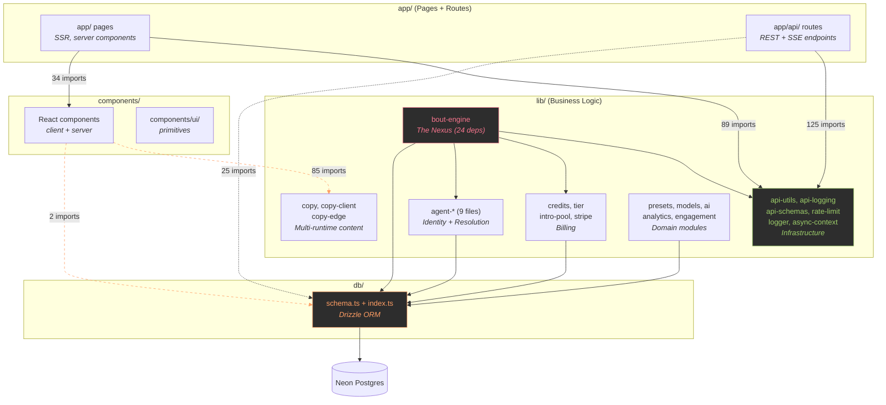
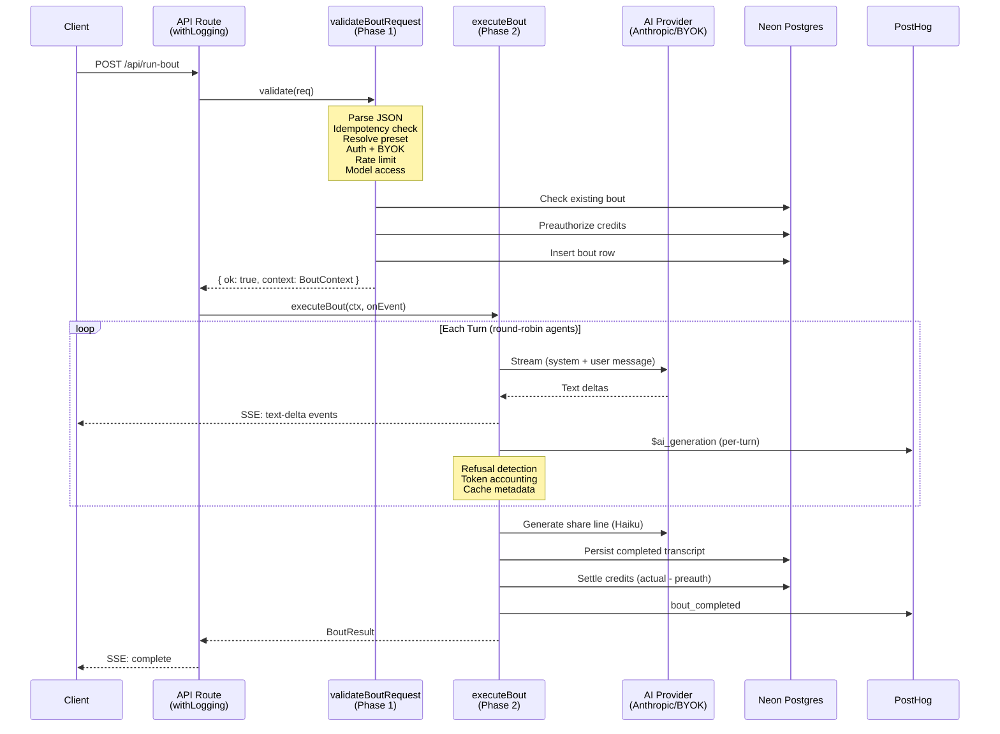
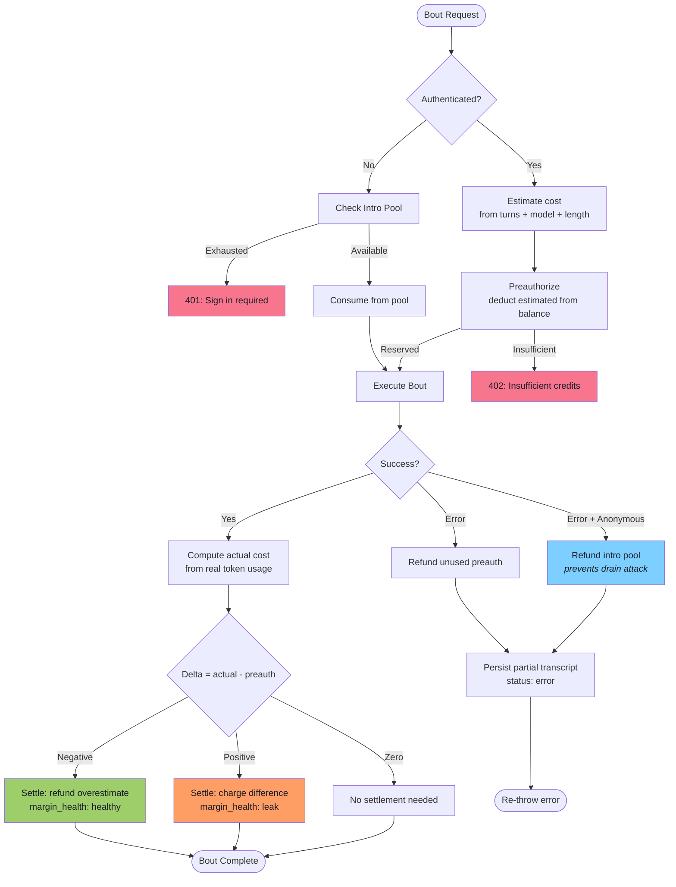

# L2: API Surface Audit

> Date: 2026-03-16
> Scope: bout-engine (L2-A), agent cluster (L2-B), API route patterns (L2-E), DAL weather eye
> Decision: SD-328 [tech-debt-exposure]
> Depends on: L1 dependency map

---

## Summary

Three audits and one cross-cutting observation. The bout-engine has a clean
two-function public API with compile-time boundary enforcement. The agent
cluster is well-structured but needs type extraction to break a circular
dependency and has dead exports to clean up. The API route pattern is
load-bearing infrastructure enforced through TypeScript's type system, not
copy-paste convention. There is no formal data access layer - 17 lib/ files
query the database directly.

---

## L2-A: bout-engine Public API Surface

### Exports

| Export | Kind | True Public | Test-Only | Dead |
|--------|------|-------------|-----------|------|
| `validateBoutRequest` | async fn | Yes (2 routes) | | |
| `executeBout` | async fn | Yes (2 routes) | | |
| `BoutValidation` | type | Yes | | |
| `BoutContext` | type | Yes | | |
| `BoutResult` | type | Yes | | |
| `TurnEvent` | type | Yes | | |
| `ByokKeyData` | type | Yes | | |
| `isAnthropicModel` | fn | | Yes (@internal) | |
| `hashUserId` | fn | | Yes (@internal) | |

### Consumers

- `app/api/run-bout/route.ts` - streaming SSE route
- `app/api/v1/bout/route.ts` - synchronous REST route
- Tests: 4 test files

### Assessment

**Clean.** Two functions and five types is the true API. The test-only
exports are marked `@internal Exported for testing only` in JSDoc. The
phase boundary is enforced by the `BoutValidation` tagged union - callers
must discriminate on `ok` before accessing `context`. This is compile-time
enforcement, not convention.

The `_executeBoutInner` function is correctly NOT exported. The tracing
wrapper (`executeBout`) is the only entry point to Phase 2.

No changes recommended. The surface is tight.

---

## L2-B: Agent Cluster API Surface

### The Cluster (9 files)

```
Layer 0 (standalone):    agent-display-name, agent-lineage, agent-links
Layer 1 (domain types):  agent-dna (types + hashing), agent-prompts (composition)
Layer 2 (persistence):   agent-mapper (row -> snapshot)
Layer 3 (orchestration): agent-registry (unified resolution), agent-detail (single-agent)
Layer 4 (data):          seed-agents (static data + builder)
```

### The Circular Dependency

```
agent-registry.ts:21 --imports--> agent-mapper.ts   (rowToSnapshot - runtime value)
agent-mapper.ts:3   --imports--> agent-registry.ts  (AgentSnapshot - type only)
```

`AgentSnapshot` is the central type of the cluster, defined in agent-registry.
But agent-mapper exists specifically to construct `AgentSnapshot` values from
DB rows. The type should live where the constructor lives, or in a separate
types file.

**Fix:** Extract `AgentSnapshot` (and related types like `AgentTier`) to
`lib/agent-types.ts`. Both agent-registry and agent-mapper import from it.
Circular disappears. Estimated effort: 15 minutes.

### Dead Exports

| Symbol | File | Status |
|--------|------|--------|
| `findAgentById` | agent-registry | Dead - zero consumers anywhere |
| `ResponseLengthId` | agent-dna | Dead re-export - no consumer |
| `ResponseFormatId` | agent-dna | Dead re-export - no consumer |

### Test-Only Exports

| Symbol | File |
|--------|------|
| `canonicalizeAgentManifest` | agent-dna |
| `canonicalizePrompt` | agent-dna |

These are exported only for test verification of the hashing internals.

### Barrel Export Opportunity

The cluster has a natural public API (~20 symbols) and clear internals
(`rowToSnapshot`). A barrel export at `lib/agents/index.ts` would define
the boundary explicitly. This is part of the lib/ restructure (BL-015,
the durian) and should be done together, not separately.

### db/ Access

3 of 9 files access db/ directly:
- `agent-registry.ts` - queries (getAgentSnapshots, registerPresetAgent, findAgentById)
- `agent-detail.ts` - queries (getAgentDetail with lineage walk)
- `agent-mapper.ts` - type-only (`agents.$inferSelect`)

The remaining 6 files have zero db/ dependency. The cluster has a de facto
data access pattern: registry and detail are the query layer, everything
else is pure logic.

---

## L2-E: API Route Pattern Audit

### Verdict: LOAD-BEARING

The API route pattern is infrastructure with real behavioral contracts,
not a template that was pasted around. Three structural reasons:

**1. Type-level enforcement.** `parseValidBody(req, schema)` returns a
discriminated union: `{ data: T; error?: never } | { data?: never; error: Response }`.
Routes must check `parsed.error` before accessing `parsed.data`. Skipping
error handling is a type error, not a convention violation.

**2. AsyncLocalStorage context.** `withLogging` wraps the handler and
injects request context (requestId, clientIp, country, userAgent, path)
into `AsyncLocalStorage`. All downstream code accesses this via
`requestStore.getStore()`. If a route skips `withLogging`, all context
lookups return undefined. This is invisible coupling that would break
silently.

**3. Centralized contracts.** `rateLimitResponse` enforces response headers
(`Retry-After`, `X-RateLimit-Remaining`, `X-RateLimit-Reset`), emits
`log.security()` events, and includes upgrade tier metadata in the body.
`errorResponse` enforces `{ error: string }` JSON shape. The frontend
depends on these shapes.

### Coverage

| Module | Routes using it | Percentage |
|--------|----------------|------------|
| `withLogging` (api-logging) | 20/20 | 100% |
| `errorResponse` (api-utils) | 18/20 | 90% |
| `checkRateLimit` (rate-limit) | 16/20 | 80% |
| Zod schema (api-schemas) | 13/20 | 65% |

### Deviations (All Justified)

| Route | Missing | Reason |
|-------|---------|--------|
| health | api-utils, rate-limit, schemas | GET endpoint, health checks should not rate-limit |
| run-bout | api-utils, rate-limit, schemas | Streaming SSE, validation in bout-engine |
| credits/webhook | rate-limit, schemas | Stripe signature verification replaces both |
| admin/seed-agents | rate-limit, schemas | Admin auth gate replaces rate limiting |
| openapi | schemas | GET endpoint, no body to validate |
| research/export | schemas | Potentially needs audit |
| v1/bout | schemas | Validation in bout-engine |

### Canonical Pattern (for reference)

```typescript
export const POST = withLogging(async function POST(req: Request) {
  // 1. Rate limit
  const rateCheck = checkRateLimit(CONFIG, clientId);
  if (!rateCheck.success) return rateLimitResponse(rateCheck);

  // 2. Parse + validate
  const parsed = await parseValidBody(req, someSchema);
  if (parsed.error) return parsed.error;
  const { field1, field2 } = parsed.data;

  // 3. Business logic
  // ...

  // 4. Response
  return Response.json({ ... });
}, 'route-name');
```

### Gap

No ADR or architecture doc describes this pattern formally. It is enforced
by the type system and by convention (100% `withLogging` adoption), but a
new contributor could skip the pattern without any lint or compile error
(except for `parseValidBody`, which is type-enforced). Worth documenting
as an ADR when the codebase reopens for active development.

---

## DAL Weather Eye: No Formal Data Access Layer

### Finding

17 of 76 lib/ files import from `db/` directly:

```
agent-detail, agent-registry, bout-engine, credits, intro-pool,
leaderboard, og-bout-image, onboarding, reactions, recent-bouts,
referrals, remix-events, research-exports, short-links, tier,
users, winner-votes
```

Plus 13 API routes and 4 app pages import db/ directly (from L1 data).

### Pattern Observed

There is a **de facto** DAL hiding in plain sight. Most of the 17 lib/ files
wrap their database queries behind exported functions:

- `getAgentSnapshots()` hides the agent query
- `getUserCredits()` hides the credits query
- `getRecentBouts()` hides the bouts query
- `getUserTier()` hides the tier lookup

The consumers of these functions (components, pages) call the function, not
the query. The problem is that nothing prevents a consumer from bypassing
the function and writing its own query. And some do - `app/b/[id]/page.tsx`
imports `db/schema` directly instead of going through a lib/ function.

### Assessment

The de facto DAL is real and mostly working. Formalizing it (e.g. requiring
all db/ access to go through lib/ functions, linting against direct db/
imports from app/ or components/) would strengthen the boundary but is not
urgent. The existing pattern has held through 60k+ LOC without breaking.

This is a "note it, do not fix it" finding. If the lib/ restructure (BL-015)
happens, that is the natural moment to formalize the DAL boundary.

---

## Architecture Diagrams

### Diagram 1: System Boundary Map



Dashed orange lines = boundary violations (direct db/ access from app/ and components/).
Red = highest risk module. Green = load-bearing infrastructure.

### Diagram 2: Bout Lifecycle Sequence



### Diagram 3: Credit Flow



---

## Combined Findings Summary

| Finding | Severity | Action |
|---------|----------|--------|
| bout-engine API surface is clean (2 fns, 5 types) | None | Preserve |
| Agent cluster circular dep (type-only) | Low | Extract AgentSnapshot to types file |
| Agent cluster dead exports (3) | Low | Remove findAgentById, dead re-exports |
| API route pattern is load-bearing infrastructure | None (positive) | Document as ADR |
| No formal DAL (17 files hit db/ directly) | Medium | Note for lib/ restructure |
| De facto DAL exists in lib/ function signatures | None (positive) | Preserve, formalize later |
| Pattern gap: no lint preventing direct db/ access | Medium | Address during BL-015 |
